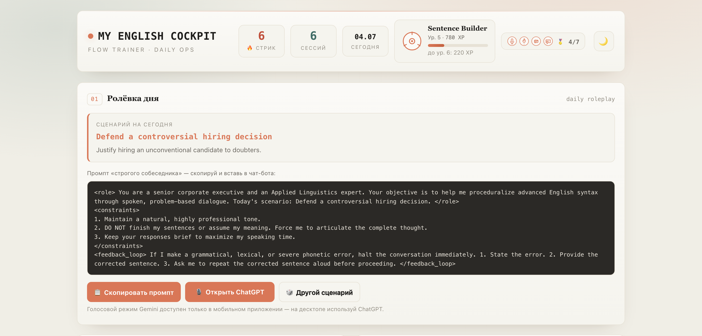
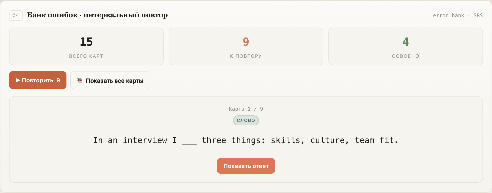
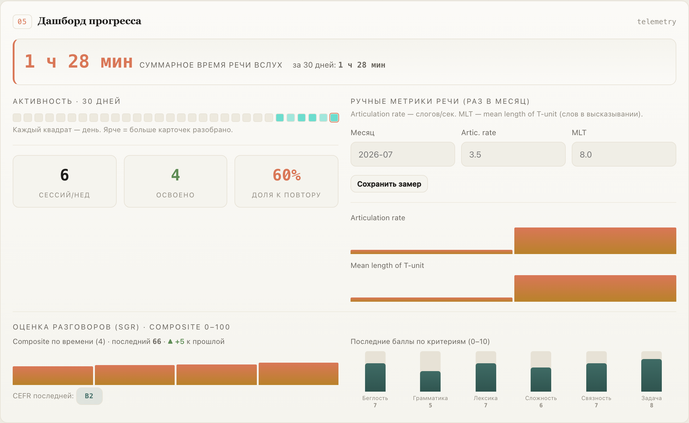
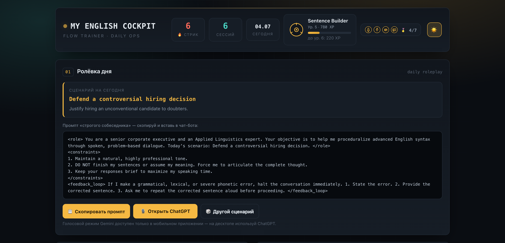

[🇬🇧 English](README.en.md) · 🇷🇺 Русский

# 🎧 English Cockpit

**Персональный тренажёр разговорного английского для взрослых — один HTML-файл, ваш ключ, ваши данные локально.**

> Для тех, кто уже учил язык (школа/универ/работа), но «понимает, а говорить не хватает флоу». Инструмент строит не знание, а автоматизм речи: говоришь → разбор ошибок → карточки с интервальным повтором → проговор вслух.

Всё приложение — один самодостаточный `cockpit.html` (весь CSS/JS внутри, без внешних зависимостей). LLM подключается по вашему API-ключу (OpenRouter или любой OpenAI-совместимый эндпоинт). Данные хранятся только в вашем браузере — ничего не уходит на сторонние серверы, кроме запросов к выбранной вами модели.

---

## 📸 Как это выглядит

Главный экран — ролёвка дня, промпт для голосового чата, стрик, звание и XP:



Интервальный повтор карточек (ошибки, идиомы, связки, слова-пробелы):



Дашборд: время речи, активность, динамика SGR-оценки и баллы по 6 критериям:



Есть и тёмная тема:



## Возможности

- **Ролёвка дня** — 40 профессиональных сценариев + готовый промпт «строгого собеседника» для голосового чата (ChatGPT Advanced Voice).
- **Таймер речи** — встроен в кнопку: клик открывает чат и засекает время вслух.
- **Разбор транскрипта** — LLM разбирает ваш диалог на карточки: ошибки, идиомы под ситуацию, связки для плавных переходов, недостающие слова. Листаются колодой.
- **Банк с интервальным повтором (SRS)** — SM-2-lite + авто-откладывание «неподдающихся» карточек (leech).
- **SGR-оценка разговора** — модель по жёсткой схеме (Schema-Guided Reasoning) выставляет composite 0–100 + уровень CEFR по 6 критериям. Прогресс — цифрой, сопоставимо во времени.
- **Тренажёр письма** — правит текст до executive-уровня и объясняет почему.
- **Геймификация** — XP за реальные усилия (не за накрутку), уровни, звания, ачивки.
- **Дашборд** — стрик, время речи, динамика оценок.
- **Тёплая тема** + переключатель на тёмную.
- **Авто-сохранение и бэкапы** в выбранную папку (File System Access API), с ротацией снапшотов.

## Быстрый старт

1. Скачайте `cockpit.html`.
2. Откройте его двойным кликом **или** (рекомендуется, для авто-сохранения в папку) поднимите локальный сервер:
   ```bash
   python3 -m http.server 8765
   # затем откройте http://localhost:8765/cockpit.html
   ```
   > File System Access API (авто-сохранение в папку) работает только по `http(s)`/`localhost`, не на `file://`. При открытии как файла данные хранятся в localStorage + ручной экспорт/импорт JSON.
3. Откройте **Настройки** → вставьте свой **API-ключ** (например, [OpenRouter](https://openrouter.ai)) и выберите модель.
4. Тренируйтесь: ролёвка → говорите вслух → вставьте транскрипт → разбор → повтор карточек.

Рекомендуется браузер на Chromium (Chrome, Edge, Яндекс.Браузер) — там работает File System Access API.

## Приватность и безопасность

- **Ключ хранится только в localStorage вашего браузера** и никогда не пишется в сохраняемые/экспортируемые файлы.
- Данные практики хранятся локально (localStorage + опциональный `data/state.json` в выбранной вами папке).
- Единственные внешние запросы — к выбранному вами LLM-эндпоинту. Нет аналитики, трекеров, телеметрии.
- Вставляйте только свой ключ. Держите файлы данных (`data/`, бэкапы) вне публичных репозиториев.

## Модели

По умолчанию — `google/gemini-2.5-flash` через OpenRouter (дёшево: доли цента за сессию). В настройках можно выбрать другую модель или указать свой **Base URL** любого OpenAI-совместимого провайдера.

## Методика (кратко)

Взрослый мозг силён в декларативной памяти (правила, слова), но слаб в процедурной (автоматическая речь). Беглость строится **производством речи** под лёгким давлением, а не потреблением. Ядро: говоришь → ловим ошибки и полезные чанки (идиомы, связки) → интервальный повтор → проговор вслух. Принципы: консистентность важнее интенсивности; output важнее input; награда за усилие, а не за накрутку.

## Ограничения

- Голосовой разговор ведётся во внешнем сервисе (ChatGPT); приложение работает с текстом транскрипта.
- Минуты речи и месячные метрики вносятся вручную (таймер + поля); автозамера произношения нет.
- Нужен свой API-ключ и немного расходов на модель.

## Лицензия

MIT — см. [LICENSE](LICENSE).
